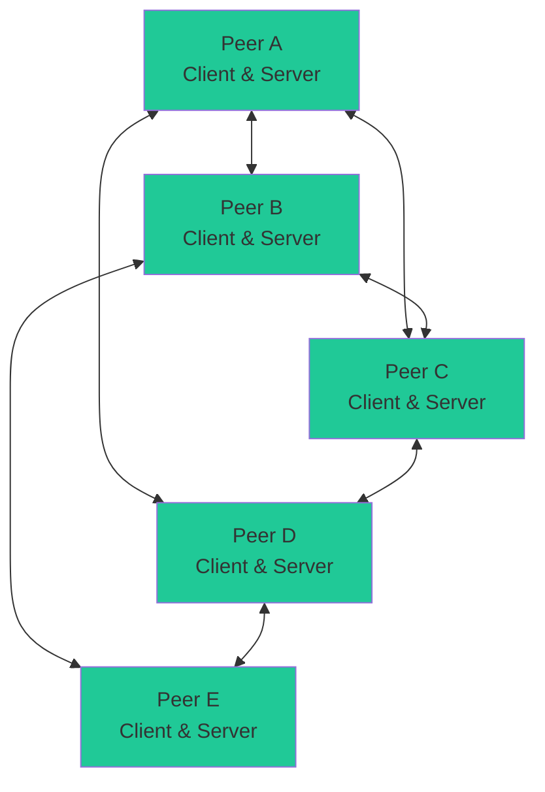
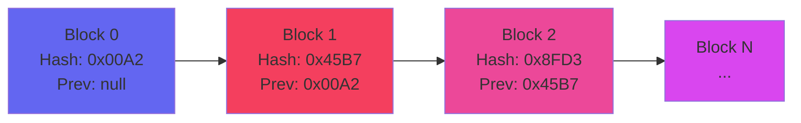
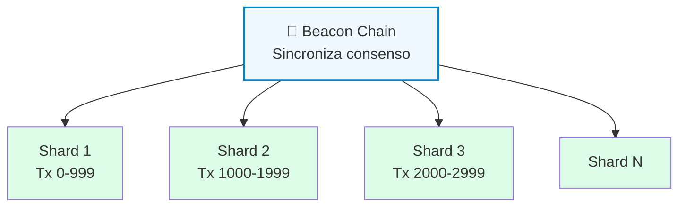
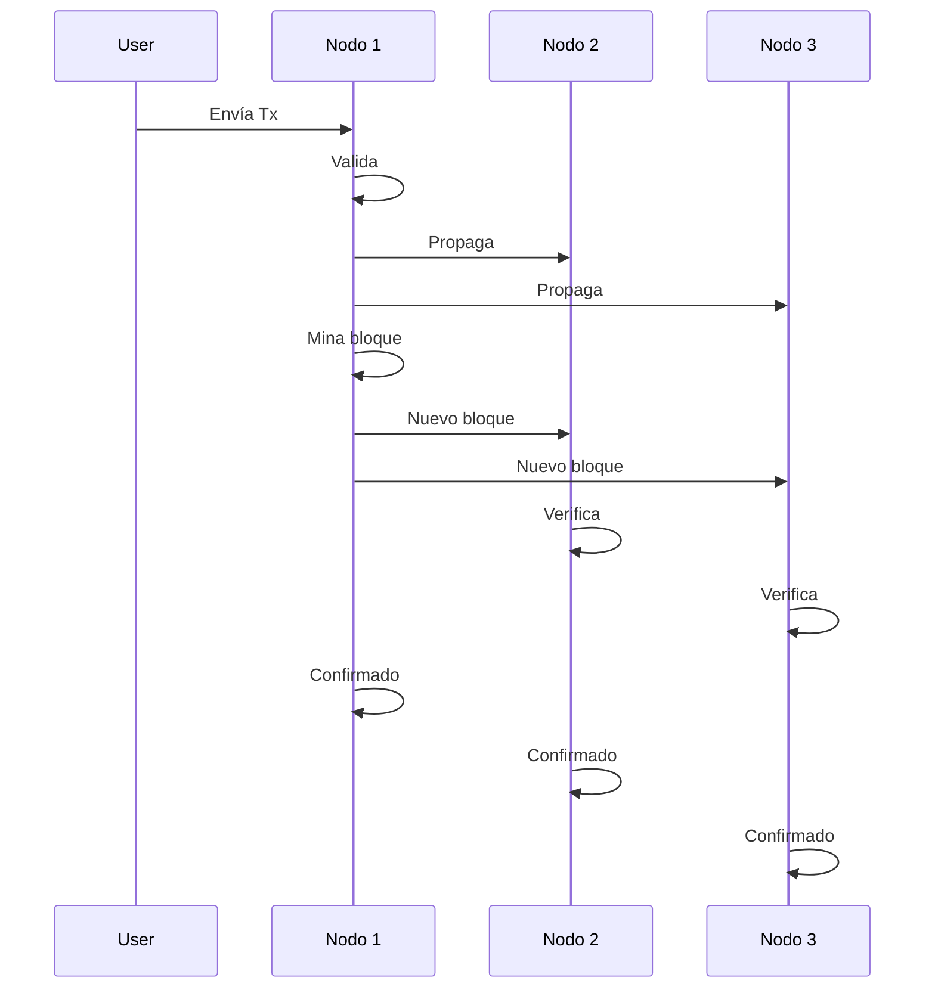
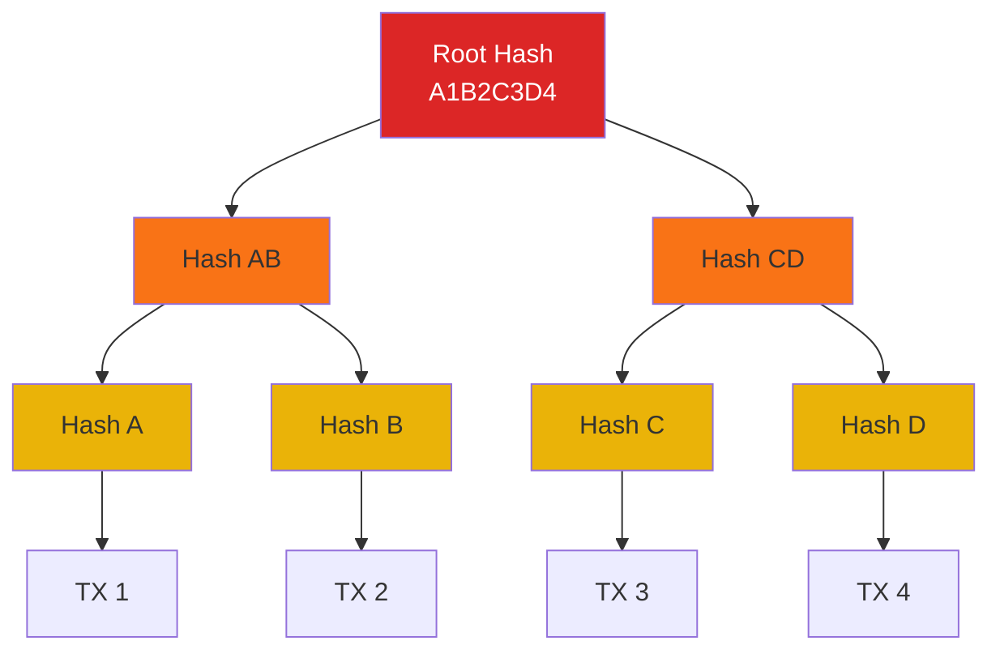

### Actividad 1.1

Que esperamos aprender de esta materia???

De esta materia espero aprender el buen manejo de las redes como tal, usar accesibilidades, posibles beneficios y buscar el origen de y tambien como entenderlas 

### Actividad 1.2

###### Que tan importantes son las redes informaticas?

Son muy importantes en el uso diario porque manejan informacion de inventarios, informacion privada, manejo de datos, comunicaciones, informacion de aprendizaje, entre otros.

### Clase 3

###### Que es una red computacional?

es un sistema complejo de intecambio de informacion, requeriendo una combinacion de infraestructura fisica y reglas logicas para una combinacion efectiva.

Nodos: Origen y destino

Enlaces: Camino fisico 

Direcciones: Identidad digital

Protocolos: El lenguaje comun

Enrutamiento: Gestion de rutas

Nodo 1 ─────Ethernet (10 Gbps)─────► Nodo 2
              (enlace más rápido)      (hub central)
                                          │
                                    Fibra Óptica
                                    (200 Mbps)
                                          │
                                       Nodo 3 ◄──── 5G (5 MHz – 35 Gbps)
                                    (servidor                  Nodo 4
                                     central)              (edge/outdoor)

###### Componentes por Nodo

#### **Nodo 1** (Entrada Local)

- **Función:** Captar datos del entorno cercano
- **Equipos:**
    - Computadora (servidor local)
    - Auditor (medición/control)
    - Lavadora inteligente (IoT)
    - Servidor (respaldo)

#### **Nodo 2** (Distribución/Mesh)

- **Función:** Repetidor, agregador, fallback
- **Equipos:**
    - Modem WiFi mesh (amplifica señal)
    - Satélite (contingencia cuando falla fibra)

#### **Nodo 3** (Centro de Control)

- **Función:** Procesar, almacenar, rutear todo
- **Equipos:**
    - Servidor principal (base de datos)
    - Switch (distribuye tráfico)
    - Antenas (conexión Nodo 4)
    - UFI y Bluetooth (acceso próximo)

#### **Nodo 4** (Remoto/5G)

- **Función:** Edge computing, acceso móvil
- **Equipos:**
    - Servidor edge (procesa localmente)
    - Computadora
    - Lavadora inteligente (IoT remoto)
    - 5G (última conexión)

- **IP** = "¿Dónde está?"
- **TCP/UDP** = "¿Cómo lo envío?"
- **MAC** = "¿Quién es en mi red?"

#### Usa TCP si:

- Los datos **no pueden perderse** (correos, dinero, archivos)
- **Orden importa** (video-conferencia con audio-video sincronizado)
- Puedes esperar un poco

#### Usa UDP si:

- **Velocidad es crítica** (juegos, streaming)
- Perder un paquete no mata la experiencia
- Muchos clientes se conectan a la vez

### Clase 4

 **Calidad de servicio (QoS):** define la calidad de servicio o por sus siglas en ingles QoS que son el conjunto de mecanismos que decide que trafico se atiende primero cuando la red no tiene capacidad suficiente para todo al mismo tiempo

**Seguridad:** se refiere a proteger la red y la informacion que circula por ella contra accesos, modificaciones o interrupciones no autorizadas

**Suplantacion de la MAC** (spoofing)

**Ataque de intrmediario** (man-in-the-middle)

**Denegacion de servicios** (DoS / DDoS)

Acceso no autorizado a un punto de acceso inalambrico

**Pishing** o ingenieria social 

### Clase 5

**Arquitectura de red:** es el conjunto de reglas y decisciones de diseno que definen como se organiza una red para que la comunicacion funcione; que funcion cumple cada parte, en que orden se procesan los datos y quien tiene cl control sobre que.

**Modelo OSI**: modelo de referencia de siete capas.

**1.- Fisica:** media, senal o transmisiones binarias 
**2.- Enlace:** Ethernet, Fibra optica, frame relay
**3.- Red:** IP, router
**4.- Transporte:** TCP, UDP, SCTP
**5.- Sesion:**  Sesion dle establecimiento
**6.- Presentacion**
**7.- Aplicacion** 
**8.- Usuario** 

**Modelo TCP/IP**: modelo de cuatro capas 

**Encapsulamiento**: al bajar or las capas, cada una envuelve el dato con su propio encabezado; al llegar al destino, el proceso se invierte y cada capa retira l encabezado que le corresponde.

#### Tarea 1.3 

Arquitectura -- P2P -- BlockChain -- Otra arquitectura emergente

**Que es el P2P?** Es una red decentralizada donde cada nodo es un cliente y servidor.
No tiene una autoridad central, cada una gestiona su propia informacion y conexiones.

**Que Puertos utiliza?** 

- 6881-6889 (BitTorrent)
- 6969 (Tracker)
- 8080 (Apps P2P genéricas)
- 30303 (Ethereum P2P)

**Diagrama:**

**Que es el BlockChain?** Es un Ledger distribuido, inmutable, una cadena de bloques que estan enlazados de forma criptografica (PoW, PoS...)

**Que Puertos utiliza?** 

- 8545 (RPC - Ethereum)
- 30303 (P2P - Ethereum)
- 8333 (Bitcoin P2P)
- 18333 (Bitcoin testnet)

**Diagrama:**

**Que son las arquitecturas emergentes?**
**Que Puertos utiliza?** 

- 8545 (RPC - Ethereum)
- 30303 (P2P - Ethereum)
- 8333 (Bitcoin P2P)
- 18333 (Bitcoin testnet)

**Diagrama: Sharing**

**Diagrama: Flujo de concenso**

**Diagrama: Merkle Tree**

